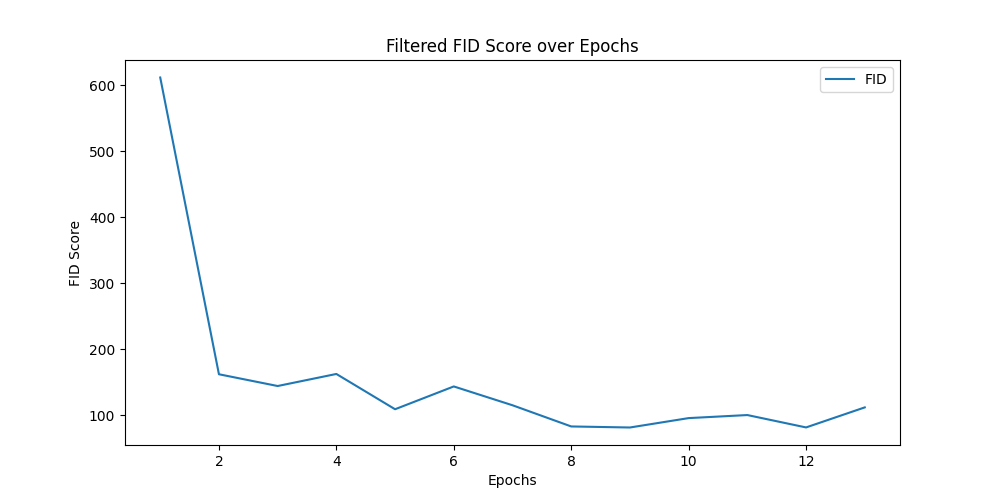
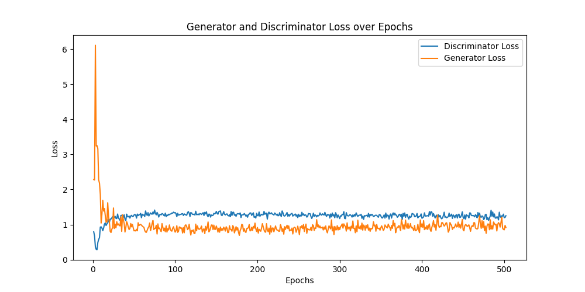

## Generative Adversarial Networks (GANs)

### Introduction

Generative Adversarial Networks (GANs) are a class of machine learning models first introduced by Ian Goodfellow and his colleagues in 2014. They consist of two neural networks – a generator and a discriminator – that compete against each other. These networks can be used to generate realistic data that resemble the training dataset. [1]

### How GANs Work

#### Basic Principle
A GAN consists of two competing networks:

- **Generator (G)**: Creates new data instances that resemble the training data.
- **Discriminator (D)**: Evaluates whether the data is real or generated by the generator.

The goal of the generator is to deceive the discriminator by producing data that appears as realistic as possible. The discriminator, on the other hand, tries to distinguish real data from fake data. This is described as a minimax game, where both networks are continuously improving to better perform their respective tasks.

#### Mathematical Formulation
The loss function of a GAN is described by the following equation [1]:

$$ \min_G \max_D V(D,G) = E_{x \sim p_{data}(x)} [ \log D(x) ] + E_{z \sim p_z(z)} [ \log (1 - D(G(z))) ] $$

### Why Use Fréchet Inception Distance (FID) in My Code

The Fréchet Inception Distance (FID) is a metric commonly used to evaluate the quality of generated data. The FID score compares the distribution of the real data with the distribution of the generated data. A lower FID score indicates that the generated data is more similar to the real data. [2]

#### Calculation of FID

The FID calculates the difference in the means and covariances between the real and generated data distributions. This difference is quantified using the following formula [2]:

$$
\text{FID} = \| \mu_r - \mu_g \|^2 + \text{Tr}(\Sigma_r + \Sigma_g - 2(\Sigma_r \Sigma_g)^{1/2}) 
$$

where $\mu_r$ and $\Sigma_r$ are the mean and covariance matrix of the real data, and $\mu_g$ and $\Sigma_g$ are the corresponding parameters of the generated data. The FID is often calculated using features extracted from a pre-trained Inception network, which enhances the robustness and reliability of the evaluation.

#### Importance of FID

The use of FID is important because it goes beyond merely evaluating the discriminator's performance. While the discriminator only differentiates between real and generated data, the FID assesses the actual similarity of the distributions. This allows for a more comprehensive and meaningful evaluation of the quality of the generated data. [2]

### Model Training

The model was trained over 500 epochs, using the FID as a metric to evaluate performance.

### GAN Training Analysis

#### Filtered FID Score over Epochs

The graph shows that the FID score quickly drops from a very high value to below 100 and then remains relatively stable. This indicates that the generator improved rapidly and then remained at a consistent level. This is a good sign, indicating that the GAN can produce high-quality images. [2]

#### Generator and Discriminator Loss over Epochs

- This graph shows the loss of the generator and discriminator over the training period.
- The discriminator loss (blue line) is relatively constant, fluctuating slightly around 1. This shows that the discriminator is working consistently and has difficulty distinguishing real from fake images, which is normal in a balanced GAN.
- The generator loss (orange line) drops quickly at the beginning and then stabilizes at a low level. A low generator loss is desirable as it indicates that the generator can produce images that the discriminator finds hard to distinguish.

#### Generated Image at 500 Epochs

The image below shows the generated image from the GAN at epoch 500.

#### Summary

- **Good Results**: The FID score shows rapid improvement and remains at a low level, indicating good image quality.
- **Stable Losses**: Both losses are stable, indicating balanced training. The discriminator is not learning too fast or too slow compared to the generator.

Overall, these results show that the GAN can generate high-quality images. There are no signs of significant issues such as mode collapse or overfitting.

#### Sources

[1] J. Gui, Z. Sun, Y. Wen, D. Tao and J. Ye, "A Review on Generative Adversarial Networks: Algorithms, Theory, and Applications," in IEEE Transactions on Knowledge and Data Engineering, vol. 35, no. 4, pp. 3313-3332, 1 April 2023, doi: 10.1109/TKDE.2021.3130191. URL: https://ieeexplore.ieee.org/abstract/document/9625798?casa_token=74ktz8Hg_jMAAAAA:Zoqv-XGMM2ly9AQ82I1G9gDKCivEyzB_LIccyX8rhRCctl5WMbPSBAS2zo8TueoOTh286vNwF4Q

[2] Yu, Yu, Weibin Zhang, and Yun Deng. "Frechet inception distance (fid) for evaluating gans." China University of Mining Technology Beijing Graduate School 3 (2021). URL: https://www.researchgate.net/profile/Yu-Yu-120/publication/354269184_Frechet_Inception_Distance_FID_for_Evaluating_GANs/links/612f01912b40ec7d8bd87953/Frechet-Inception-Distance-FID-for-Evaluating-GANs.pdf